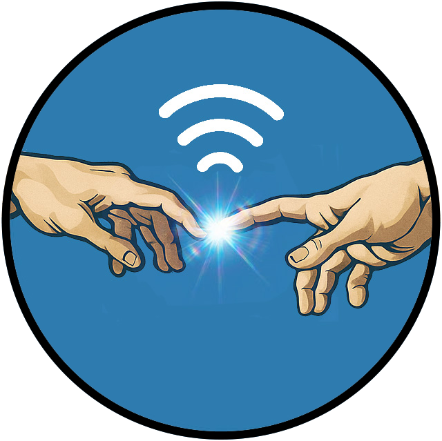

# JustTouch

**JustTouch** is a cross-platform file sharing app for Android, iOS, Windows, macOS, and Linux. Share files with just a tap on mobile devices via NFC, or use QR codes on any platform. Pick one or more files, generate a web link, and send it to another device. The other person gets the link and downloads the file directly. No pairing, no logins, no cloud, no app installation required.

## Platforms

### 📱 Mobile (Android/iOS)
- **NFC sharing**: Touch devices to share instantly. (Android only - Apple sucks)
- **QR code sharing**: Scan codes to share
- **Share menu integration**: Share from Gallery, Files, etc. (Android)

### 🖥️ Desktop (Windows/macOS/Linux)
- **QR code sharing**: Primary sharing method- **File server**: Local HTTP server for file hosting

## What It Does

- Lets you choose one or more files from your device
- Creates a web link for the selected files
- Shares that web link via NFC (mobile) or QR code (all platforms)
- The receiving device uses the link to download the file(s)

## How It Works

1. **Sender:**
   - Open the app
   - Select the file(s) you want to share
   - Tap your phone to another device - the web link is sent via NFC
   - The receiver gets the link open in their browser and downloads the file(s)

2. **Receiver:**
   - Just Touch.

## Why Web Links?

We use web links because they’re lightweight, fast to share, and work great with peer-to-peer protocols. The actual files aren’t sent over NFC — just the link. File transfer happens over the internet using the web link, similar to how torrents work.
